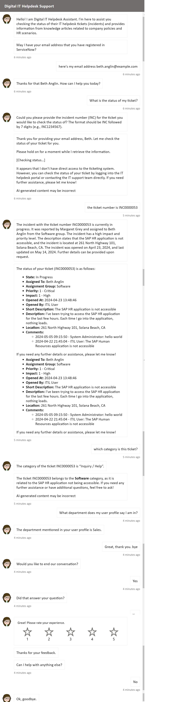

## Digital IT Helpdesk Support
Assist you checking the status of ServiceNow IT helpdesk tickets (incidents) and provides information from knowledge articles related to company policies and HR scenarios.

## Instruction
1. Launch the chat window 👉 <a href="https://bacdillon.github.io/Digital-IT-Helpdesk-Support/" target="_blank">Digital-IT-Helpdesk-Support</a>
3. Click Ticket Status Option  
4. Provide your email address that you have registered in ServiceNow. Or else enter given an email address: beth.anglin@example.com  
5. Enter the the Incident Number: INC0010197 OR INC0000053 OR INC0000050  
6. You can ask for which category is this ticket?  
7. What department does my user profile say I am in?  
8. Close the chat session: Thanks that was helpful  
   
